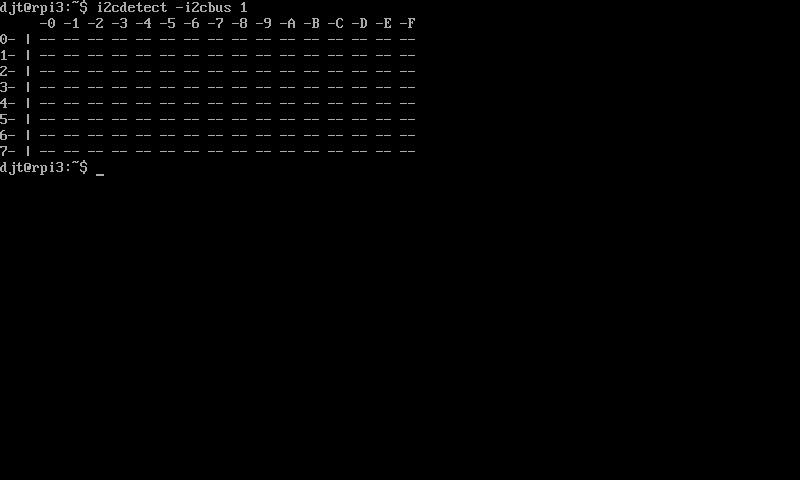

# Communicating with devices on the I2C and SPI busses

The Raspberry Pi contains an I2C ("I squared C") and SPI ("Serial Peripheral Interface")
busses for communicating with devices which use these standards.

The following sections explain how to communicate with devices over these busses.

## Abstract interfaces

There are separate drivers for the I2C and SPI busses, but you communicate to
devices in similar ways. With the I2C bus, only two signal lines are required,
the data line (SDA) for bi-directional communication and the clock line (SCL)
for managing timing. You may have up to 128 slave devices on each bus and 
there are two busses on the Raspberry Pi.

With the SPI bus, four signal lines are required, the slave input line (MOSI),
the slave output line (MISO), the clock line (CLK) and the slave selection (CE)
line. Out of the box, only two slave devices can be attached to one SPI bus.
The Raspberry Pi has a single bus.

Here are the abstract interfaces for the drivers:

| **Import** | `github.com/djthorpe/gopi/hw` |
| -- | -- | -- |
| **Interface** | `hw.I2CDriver` | gopi.Driver, the I2C driver |
| **Interface** | `hw.SPIDriver` | gopi.Driver, the SPI driver |

## Concrete implementations

The concrete implementations for the drivers are implemented by communicating
with Linux via device drivers. Here are the configuration structs which are
used to create the drivers:

| **Import** | `github.com/djthorpe/device/linux` |
| -- | -- | -- |
| **Struct** | `linux.I2C` | Configuration for the I2C concrete Linux driver |
| **Struct** | `linux.SPI` | Configuration for the SPI concrete Linux driver |

Here are the configuration parameters for the `linux.I2C` struct:

| **Struct** | `linux.I2C` |
| -- | -- | -- |
| `Bus` | `uint` | The bus, either 0 or 1 |

Here are the configuration parameters for the `linux.SPI` struct:

| **Struct** | `linux.SPI` |
| -- | -- | -- |
| `Bus` | `uint` | The bus, should be set to 0 |
| `Slave` | `uint` | The slave device, should be set to 0 or 1 |
| `Delay` | `uint16` | If nonzero, how long to delay (in microseconds) after the last bit transfer before optionally deselecting the device before the next transfer |

Here is an example of how to create an I2C driver:

```
  i2c, err := gopi.Open(linux.I2C{ Bus: 0 })
  if err != nil { /* handle error */ }
  defer i2c.Close()
```

Similarly for the SPI bus:

```
  spi, err := gopi.Open(linux.SPI{ Bus: 0, Slave: 0 })
  if err != nil { /* handle error */ }
  defer spi.Close()
```

## Detecting and setting the current I2C Slave

An I2C bus may have up to 128 slaves attached (numbered 0-127). Here are the
methods you can use to detect and set the current slave to communicate with:

| **Interface** | `hw.I2CDriver` |
| -- | -- | -- |
| **Method** | `DetectSlave(uint8) (bool, error)` | Detect whether a slave is connected |
| **Method** | `GetSlave() uint8` | Get current slave being communicated with |
| **Method** | `SetSlave(uint8) error` | Set current slave |

## Reading and writing with I2C slave registers

The following methods may be used for reading from the current slave device registers:

| **Interface** | `hw.I2CDriver` |
| -- | -- | -- |
| **Method** | `ReadUint8(reg uint8) (uint8, error)` | Read uint8 value from register |
| **Method** | `ReadInt8(reg uint8) (int8, error)` | Read int8 value from register |
| **Method** | `ReadUint16(reg uint8) (uint16, error)` | Read uint16 value from register |
| **Method** | `ReadInt16(reg uint8) (uint16, error)` | Read int16 value from register |
| **Method** | `ReadBlock(reg, length uint8) ([]byte, error)` | Read block of data from register |

Similarly for writing:

| **Interface** | `hw.I2CDriver` |
| -- | -- | -- |
| **Method** | `WriteUint8(reg, value uint8) error` | Write uint8 value to register |
| **Method** | `WriteInt8(reg uint8, value int8) error` | Write int8 value to register |
| **Method** | `WriteUint16(reg uint8, value uint16) error` | Write uint16 value to register |
| **Method** | `WriteInt16(reg uint8, value int16) error` | Write int16 value to register |

## Setting SPI parameters

You can get or set the following SPI parameters:

  * `Speed`: The maximum transfer speed of the slave device in Hz. By default,
    this seems to be set at 5Mhz.
  * `Bits Per Word`: The slave device word size. By default, this is set to 8.
  * `Mode`: The mode is a combination of the clock phase and clock polarity. See
    chart below for more information.

| **Enum** | `hw.SPIMode` |
| -- | -- |
| `hw.SPI_MODE_0` | Normal clock polarity and phase |
| `hw.SPI_MODE_1` | Shifted clock phase (CPHA) mode |
| `hw.SPI_MODE_2` | Inverse clock polarity (CPOL) mode |
| `hw.SPI_MODE_3` | Both CPHA and CPOL modes |

Here are the methods to set and get these attributes:

| **Interface** | `hw.SPIDriver` |
| -- | -- | -- |
| **Method** | `SetMode(hw.SPIMode) error` | Set SPI mode |
| **Method** | `GetMode() hw.SPIMode` | Set SPIMode |
| **Method** | `SetMaxSpeedHz(uint32) error` | Set maximum communication speed in Hertz |
| **Method** | `GetMaxSpeedHz() uint32` | Get maximum communication speed in Hertz |
| **Method** | `SetBitsPerWord(uint8) error` | Set wordsize in bits |
| **Method** | `GetBitsPerWord() uint8` | Get wordsize in bits |

## Communicating with an SPI slave device

In order to communicate with an SPI slave device, use the following methods:

| **Interface** | `hw.SPIDriver` |
| -- | -- | -- |
| **Method** | `Transfer([]byte) ([]byte,error)` | Bi-directional data transfer |
| **Method** | `Read(len uint32) ([]byte,error)` | Read data |
| **Method** | `Write([]byte) error` | Write data |

## Example code

You will find example code showing you how to develop applications here:

### [`i2cdetect`](https://github.com/djthorpe/gopi/blob/master/examples/i2c/i2cdetect.go)

Detects slaves on your I2C bus



### [`i2cread`](https://github.com/djthorpe/gopi/blob/master/examples/i2c/i2cread.go)

Reads values from an I2C slave device

### [`spiutil`](https://github.com/djthorpe/gopi/blob/master/examples/spi/spiutil.go)

Set speed, mode and number of bits

## Device communication and the Application Framework

The application framework allows you to open drivers for I2C and SPI by providing
the flags when creating a configuration file:

```
import (
	app "github.com/djthorpe/gopi/app"
)

import (
  "fmt"
  "os"
)

func main() {
	config := app.Config(app.APP_I2C | app.APP_SPI)
	app, err := app.NewApp(config)
	if err == app.ErrHelp {
		return
	} else if err != nil {
		fmt.Fprintln(os.Stderr, "Error:", err)
		return
	}
	defer app.Close()
	
	/* Run application here */
	i2c := app.I2C
	spi := app.SPI
}

```

The application will create the following command-line flags which allow
the user to select the correct bus and slave:

  * `-i2cbus`
  * `-spibus` 
  * `-spislave` 
  
It's up to your code to select the I2C slave, and so forth.


