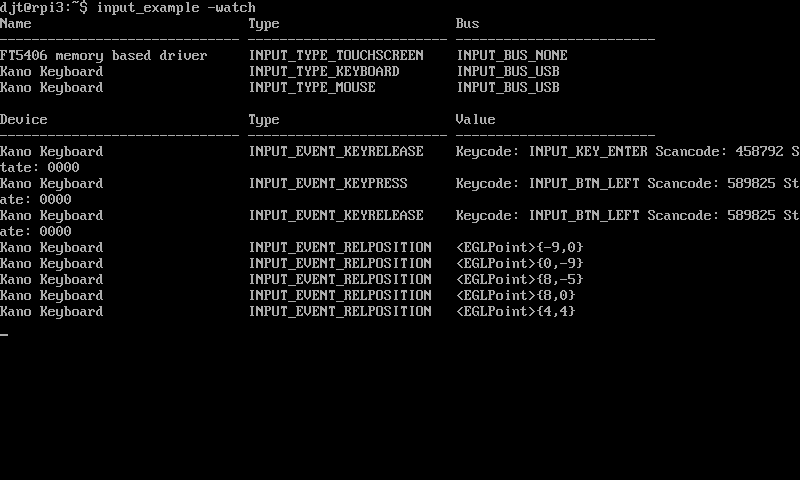

# Input Devices

In order to obtain input from keyboards, mice, touchscreens and joysticks
there is an abstract interface to input devices which you can use to accept
events such as key presses and positional changes. The following sections
describe how to combine these concepts.

## Abstract Interface

There are three main concepts with input devices:

  * The **Input Driver** provides a way to discover, open, close and watch devices.
  * The **Input Device** represents a single device such as a mouse, keyboard,
    touchscreen or joystick
  * An **Input Event** is emitted when an input device changes state. For example,
    a key was pressed or the mouse was moved.

There are other enumerations, interfaces and structs which support these concepts:	

| **Import** | `github.com/djthorpe/gopi/hw` |
| -- | -- | -- |
| **Interface** | `hw.InputDriver` | gopi.Driver, implements driver for all devices |
| **Interface** | `hw.InputDevice` | gopi.Driver, implements a single device |
| **Enum**   | `hw.InputDeviceType` | Type of an input device |
| **Enum**   | `hw.InputDeviceBus` | How the input device is connected |
| **Struct** | `hw.InputEvent` | An event emitted by a device |
| **Enum**   | `hw.InputEventType` | Type of event emitted |
| **Enum**   | `hw.InputKeyCode` | The key pressed or mouse button activated |
| **Enum**   | `hw.InputKeyState` | Keyboard state (Caps Lock, Num Lock, Shift, etc) |
| **Function** | `hw.InputEventCallback` | func(event *hw.InputEvent, device hw.InputDevice) |

## Concrete Implementation

The concrete implementation of the driver and devices are currently only for linux:

| **Import** | `github.com/djthorpe/gopi/device/linux` |
| -- | -- | -- |
| **Struct** | `linux.InputDriver` | Concrete Linux input driver configuration |
| **Struct** | `linux.InputDevice` | Concrete Linux input device |

## The Input Driver

The `linux.InputDriver` configuration supports a single configuration parameter:

| **Struct** | `linux.InputDriver` |
| -- | -- | -- |
| **Bool** | Exclusive | Whether to open devices for exclusive access |

The input driver and input device implements the `gopi.Driver` interface so
can be opened in the usual way:

```go
input, err := gopi.Open(linux.InputDriver{ Exclusive: true },logger)
if err != nil { /* handle error */ }
defer input.Close()
```

The `hw.InputDriver` interface should implement the following methods:

| **Interface** | `hw.InputDriver` |
| -- | -- | -- |
| **Method** | `Close() error` | Release all devices and close |
| **Method** | `OpenDevicesByName(name string, flags hw.InputDeviceType, bus hw.InputDeviceBus) ([]hw.InputDevice, error)` | Open devices |
| **Method** | `CloseDevice(device hw.InputDevice) error` | Close a device |
| **Method** | `GetOpenDevices() []hw.InputDevice` | Return array of currently open devices |
| **Method** | `Watch(delta time.Duration,callback hw.InputEventCallback) error` | Watch for events and callback on emitted event |

To discover a set of devices, simply use the `OpenDevicesByName` method, which
will return devices based on criteria you provide. You can provide a name of
device, a set of device types and the bus on which the device needs to be
connected. These arguments are described in more detail below.

The function will return an array of new devices opened and any error code if the
operation was unsuccessful. If you call this method more than once, it will only
open devices if they are not yet opened.

Looking at the arguments to the method, you can set the `name` parameter as
empty or refer to a device by it's full name, alias or physical connection
name. If empty, all devices discovered will be considered.

The `flags` argument can either be `hw.INPUT_TYPE_ANY` to match all types of
device, or you can provide an OR'ed set of device types.

| **Enum** | `hw.InputDeviceType` |
| -- | -- |
| `hw.INPUT_TYPE_NONE` | None or unknown device type |
| `hw.INPUT_TYPE_KEYBOARD` | Keyboard |
| `hw.INPUT_TYPE_MOUSE` | Mouse |
| `hw.INPUT_TYPE_TOUCHSCREEN` | Multi-touch input device |
| `hw.INPUT_TYPE_ANY` | Matches any device when calling `OpenDevicesByName` |

For example, to open any mouse and keyboard:

```go
  devices, err := input.(hw.InputDriver).OpenDevicesByName("",hw.INPUT_TYPE_MOUSE | hw.INPUT_TYPE_KEYBOARD,hw.INPUT_BUS_ANY)
  if err != nil {
	/* handle the error */
  }
  if len(devices) == 0 {
    /* no devices found */
  }
```

The `bus` argument can be used to open devices on a specific bus, or use
`hw.INPUT_BUS_ANY` otherwise.

| **Enum** | `hw.InputDeviceBus` |
| -- | -- |
| `hw.INPUT_BUS_NONE` | Unknown device bus |
| `hw.INPUT_BUS_USB` | USB Bus |
| `hw.INPUT_BUS_BLUETOOTH` | Bluetooth Bus |
| `hw.INPUT_BUS_ANY` | Matches any bus when calling `OpenDevicesByName` |

To close devices use the `CloseDevice` method:

```go
  err := input.(hw.InputDriver).CloseDevice(mouse)
  if err != nil { /* handle the error */ }
```

By closing a device, it is removed from the list of opened devices,
the device no longer emits events and any exclusivity for access is released.

## Input Events

For all opened devices, events are emitted and can be consumed by calling
the `Watch` method. This method uses a `delta` argument which determines how
long you want to watch a device for, and a `callback` method which is called
for each event emitted. If no events are emitted within the specified time, then
the Watch method returns `nil`. It will return with an error before this if
some unexpected condition occurs:

```go
  err := input.(hw.InputDriver).Watch(time.Second * 5,func (event hw.InputEvent,device hw.InputDevice) {
	fmt.Println("DEVICE=",device)
	fmt.Println("EVENT=",event)
  })
  if err != nil { /* handle the error */ }
```

Practically, you will want to continue watching for events until your application
ends, and you'll want to do it in the background. See below for information on
how to implement this pattern.

The `hw.InputEvent` structure provides information on the event which has been
emitted:

| **Struct** | `hw.InputEvent` |
| -- | -- | -- |
| **time.Duration** | `Timestamp` | The timestamp for an event, to nanosecond resolution |
| **hw.InputDeviceType** | `DeviceType` | The type of device emitting the event |
| **hw.EventType** | `EventType` | The type of event being emitted |
| **hw.InputKeyCode** | `Keycode` | For press, release and repeat events, the key or mouse button |
| **uint32** | `Scancode` | The keyboard scancode for press and release events |
| **khronos.EGLPoint** | `Position` | For touchscreen and mouse device types, the absolute position being tracked |
| **khronos.EGLPoint** | `Relative` | For mouse device types, the relative position compared to last position |
| **uint** | `Slot` | For multi-touch events, the slot number |

There are a number of different types of events. Fields of `hw.InputEvent` are
populated differently depending on the type of event.

| **Enum** | `hw.InputEventType` |
| -- | -- |
| `hw.INPUT_EVENT_KEYPRESS` | Mouse, touchscreen or keyboard key press |
| `hw.INPUT_EVENT_KEYRELEASE` | Mouse, touchscreen or keyboard key release |
| `hw.INPUT_EVENT_KEYREPEAT` | Keyboard key being held down |
| `hw.INPUT_EVENT_ABSPOSITION` | Mouse or touch screen absolute position |
| `hw.INPUT_EVENT_RELPOSITION` | Mouse or touch screen relative position change |
| `hw.INPUT_EVENT_TOUCHPRESS` | Touchscreen press |
| `hw.INPUT_EVENT_TOUCHRELEASE` | Touchscreen press |
| `hw.INPUT_EVENT_TOUCHPOSITION` | Touchscreen position change |


### Keyboards

For **keyboard** devices, the `Keycode` and `Scancode` fields will be set, where the
key code determines the pressed key. Scancode is usually a device-specific
code translated into the keycode by the keyboard hardware. Here are some example key
codes, but the full list is available in the source code:

| **Enum** | `hw.InputKeyCode` |
| -- | -- |
| `hw.INPUT_KEY_ESC` | Escape |
| `hw.INPUT_KEY_TAB` | Tab |
| `hw.INPUT_KEY_ENTER` | Enter |
| `hw.INPUT_KEY_SPACE` | Space Bar |
| `hw.INPUT_KEY_UP` | Arrow Up |
| `hw.INPUT_KEY_DOWN` | Arrow Down |
| `hw.INPUT_KEY_LEFT` | Arrow Left |
| `hw.INPUT_KEY_RIGHT` | Arrow Right |

Here is how you might want to decode keyboard information:

```go
func ProcessEvents (event hw.InputEvent,device hw.InputDevice) {
	if event.DeviceType != hw.INPUT_TYPE_KEYBOARD {
		// Ignore non-keyboards
		return
	}
	switch event.EventType {
	case hw.INPUT_EVENT_KEYPRESS:
		fmt.Printf("Key pressed = %v\n",event.Keycode)
	case hw.INPUT_EVENT_KEYRELEASE:
		fmt.Printf("Key released = %v\n",event.Keycode)
	case hw.INPUT_EVENT_KEYREPEAT:
		fmt.Printf("Key held down = %v\n",event.Keycode)
	default:
		// Ignore all other events
	}
}
```

No account is taken of caps lock, number lock, shift, alt or meta keys. For that
information, you need to read the current device state (see below). Also note
that in order to map key presses to characters or runes, you will need to
implement a key mapping, which takes into account the device state. For the
moment, that exercise is left to the reader.

### Mice

For **mouse** devices, relative positions are reported, but the absolute position
is also set synthetically and can be changed at any time by calling the
`SetPosition` method of `hw.InputDevice`. Mouse devices also report on button
presses.

| **Enum** | `hw.InputKeyCode` |
| -- | -- |
| `hw.INPUT_BTN_LEFT` | Left Mouse Button |
| `hw.INPUT_BTN_MIDDLE` | Middle Mouse Button |
| `hw.INPUT_BTN_RIGHT` | Right Mouse Button |
| `hw.INPUT_BTN_SIDE` | Side Mouse Button |

Here is an example of how you might want to decode information provided by
mice:

```go
func ProcessEvents (event hw.InputEvent,device hw.InputDevice) {
	if event.DeviceType != hw.INPUT_TYPE_MOUSE {
		return
	}
	switch event.EventType {
	case hw.INPUT_EVENT_KEYPRESS:
		fmt.Printf("Mouse button pressed = %v\n",event.Keycode)
	case hw.INPUT_EVENT_KEYRELEASE:
		fmt.Printf("Mouse button released = %v\n",event.Keycode)
	case hw.INPUT_EVENT_RELPOSITION:
		fmt.Printf("Mouse moved by %v (position %v)\n",event.Relative,event.Position)
	default:
		// Ignore all other events
	}
}
```

The absolute position of the mouse pointer is calculated from the relative
position, and can be set using the `SetPosition` method of the device.

### Touchscreens

For **touchscreen** devices, these are generally _multi-touch_. For example, you
can activate two different points on the touch device simultaneously with fingers
or styluses. Touchscreen devices will therefore not only report on absolute
position changes and key press events, but also report individually using the
`hw.INPUT_EVENT_TOUCHPRESS`, `hw.INPUT_EVENT_TOUCHRELEASE` and `hw.INPUT_EVENT_TOUCHPRESS`
for each of the simultaneous touches, or **slots**.

| **Enum** | `hw.InputKeyCode` |
| -- | -- |
| `hw.INPUT_BTN_TOUCH` | Touchscreen Button |

You can either treat touchscreens as single-touch devices with only one absolute
position reported, or as multi-touch devices with several positions reported. For
single-touch:

```go
func ProcessEvents (event hw.InputEvent,device hw.InputDevice) {
	if event.DeviceType != hw.INPUT_TYPE_MOUSE {
		return
	}
	switch event.EventType {
	case hw.INPUT_EVENT_KEYPRESS:
		fmt.Printf("Touch screen pressed = %v\n",event.Keycode)
	case hw.INPUT_EVENT_KEYRELEASE:
		fmt.Printf("Touch screen released = %v\n",event.Keycode)
	case hw.INPUT_EVENT_ABSPOSITION:
		fmt.Printf("Touch screen pressed at position %v\n",event.Position)
	default:
		// Ignore all other events
	}
}
```

Alternatively, for multi-touch:

```go
func ProcessEvents (event hw.InputEvent,device hw.InputDevice) {
	if event.DeviceType != hw.INPUT_TYPE_MOUSE {
		return
	}
	switch event.EventType {
	case hw.INPUT_EVENT_TOUCHPRESS:
		fmt.Printf("Touch screen slot %v pressed = %v\n",event.Slot,event.Keycode)
	case hw.INPUT_EVENT_TOUCHRELEASE:
		fmt.Printf("Touch screen slot %v released = %v\n",event.Slot,event.Keycode)
	case hw.INPUT_EVENT_TOUCHPOSITION:
		fmt.Printf("Touch screen slot %v pressed at position %v\n",event.Slot,event.Position)
	default:
		// Ignore all other events
	}
}
```


## Input Devices

In general you will interact with devices through an `hw.InputDriver` object but
there's the possibility of implementing your own input device and having it emit
events (for example, if you craft a joystick from switches on the GPIO port). The
interface for the abstract device has the following methods:

| **Interface** | `hw.InputDevice` |
| -- | -- | -- |
| **Method** | `Close() error` | Release resources and close |
| **Method** | `GetName() string` | Return name of the device |
| **Method** | `GetType() hw.InputDeviceType` | Return type of input device |
| **Method** | `GetBus() hw.InputDeviceBus` | Return bus input device is connected to |
| **Method** | `GetPosition() khronos.EGLPoint` | Get absolute position of mouse |
| **Method** | `SetPosition(khronos.EGLPoint)` | Set absolute position of mouse |
| **Method** | `GetKeyState() hw.InputKeyState` | Get state of keyboard |
| **Method** | `SetKeyState(flags hw.InputKeyState,state bool) error` | Set state of keyboard |
| **Method** | `Matches(alias string, device_type hw.InputDeviceType, device_bus hw.InputDeviceBus) bool` | Return true if device matches name, type and bus criteria |

An input device can be opened using the usual `gopi.Open` method. There is one concrete Linux device
implementation:

| **Struct** | `linux.InputDevice` |
| -- | -- | -- |
| **Bool** | Exclusive | Whether to open device with exclusive access |
| **String** | Path | The path to the linux driver |

For example,

```go
device, err := gopi.Open(linux.InputDevice{ Path: '/dev/input/event0', Exclusive: true },logger)
if err != nil { /* handle error */ }
defer device.Close()
```

### Position information

TODO: Position and State information

### Keyboard state

TODO: Position and State information

### Implementing an input device

TODO: Implementing your own device

## Example code

There is an example command-line application `examples/input/input_example.go` which
demonstrates how to open devices and watch for events. For example, running the
application with the `-watch` flag will open all devices and start watching
for events:



Using the `-help` flag shows the other flags you can use:

  * `-name string` Name of input device
  * `-bus string` Input bus (any, usb, bluetooth) (default "any")
  * `-type string` Input type (any, mouse, keyboard, joystick, touchscreen) (default "any")
  * `-watch` Watch for events from devices until CTRL+C is pressed
  * `-log path` File used for logging
  * `-debug` Trigger debugging support (which shows more information)
  * `-verbose` Log verbosely

You can also see how to move a cursor sprite on-screen in reaction to mouse and
touchscreen events in `examples/egl/cursor_example.go`.

### Implementing a Watch loop

TODO

### Implementing a Key to character map

TODO

## Input Devices and the Application Framework

TODO


